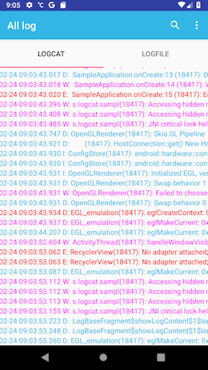

[](https://jitpack.io/#AppDevNext/Logcat)

# LogcatLib - Show Logcat in release buildtype and Timber log when it logs to a file

This library provides an easy way to show Logcat in `release` ! and Timber history, which was written to file.
Right Timber `FileLoggingTree.kt` is provided too  



## Include the library

The easiest way to add Logcat to your project is via Gradle. Just add the following lines to your `build.gradle`:

```groovy
dependencies {
    implementation 'com.github.AppDevNext:Logcat:$latest_version'
}
```

To tell Gradle where to find the library, make sure `build.gradle` also contains this:

```groovy
allprojects {
    repositories {
        ...
        maven { url 'https://jitpack.io' }
    }
}
```

## Crashlytic integration

### Features

* Get crash reports
* Get non-fatal errors into Firebase Crashlytics dashboard in an easy way with Timber
* Disable sending the reports to Firebase Crashlytics in DEBUG mode
* A crash will be reported automatically
* Logs a non-fatal via Timber.e() or Timber.w()

        externalCacheDir?.let {
            Timber.plant(FileLoggingTree(it, this))
        }

        val crashlytics = CrashlyticsCore.Builder()
                .disabled(false)
                .build()
        Fabric.with(baseContext, Crashlytics.Builder().core(crashlytics).build(), Answers())
        Crashlytics.setString(BuildConfig.FLAVOR, BuildConfig.VERSION_NAME)
        Timber.plant(CrashlyticsTree(Settings.Secure.getString(applicationContext.contentResolver, Settings.Secure.ANDROID_ID)))


## License

    Copyright (C) 2012-2019 AppDevNext

    Licensed under the Apache License, Version 2.0 (the "License");
    you may not use this file except in compliance with the License.
    You may obtain a copy of the License at

       http://www.apache.org/licenses/LICENSE-2.0

    Unless required by applicable law or agreed to in writing, software
    distributed under the License is distributed on an "AS IS" BASIS,
    WITHOUT WARRANTIES OR CONDITIONS OF ANY KIND, either express or implied.
    See the License for the specific language governing permissions and
    limitations under the License.
